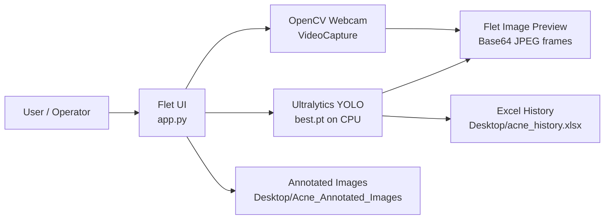
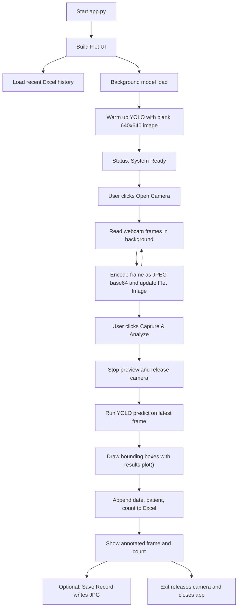
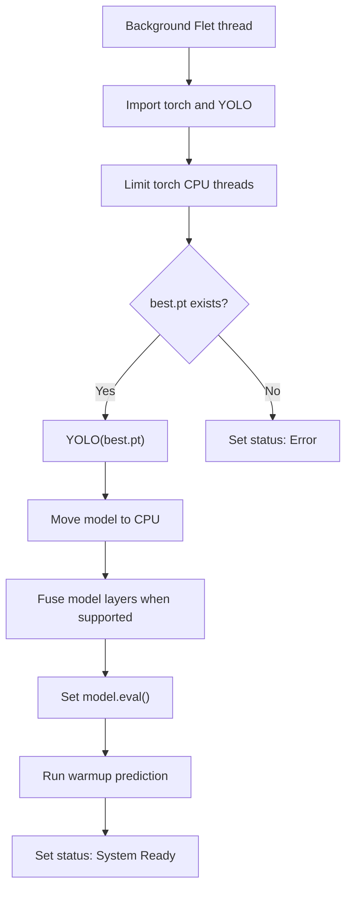
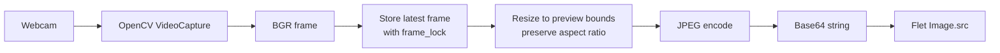
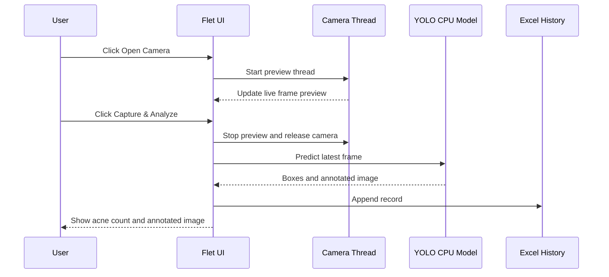

# Acne Detection Kiosk

Acne Detection Kiosk is a desktop camera application for capturing a face image, running acne/object detection with a local Ultralytics YOLO model, displaying the detected acne count, saving an annotated image, and maintaining a small Excel-based patient history log.

The current primary application is the Flet implementation in `app.py`. The repository also contains `main.py`, the earlier CustomTkinter implementation with the same core workflow.

## Table of Contents

- [Features](#features)
- [Technology Stack](#technology-stack)
- [Project Structure](#project-structure)
- [Runtime Requirements](#runtime-requirements)
- [How to Run](#how-to-run)
- [High-Level Architecture](#high-level-architecture)
- [Application Flow](#application-flow)
- [Model and Detection Algorithm](#model-and-detection-algorithm)
- [Camera Feed Pipeline](#camera-feed-pipeline)
- [Capture and Analysis Pipeline](#capture-and-analysis-pipeline)
- [History and Output Storage](#history-and-output-storage)
- [CPU Performance Optimizations](#cpu-performance-optimizations)
- [Important Constants](#important-constants)
- [Packaging Notes](#packaging-notes)
- [Troubleshooting](#troubleshooting)
- [Future Improvements](#future-improvements)

## Features

- Live camera preview from the default webcam.
- Patient name entry.
- CPU-based acne detection using a local YOLO `.pt` model.
- Detection count display.
- Annotated image preview after analysis.
- Save annotated images to the Desktop.
- Save visit history to an Excel file.
- Recent history panel showing the last 15 records.
- CPU-oriented settings for lower overhead on machines without a GPU.

## Technology Stack

| Area | Tool/Library | Purpose |
| --- | --- | --- |
| Desktop UI | Flet | Main user interface in `app.py` |
| Legacy UI | CustomTkinter | Older UI implementation in `main.py` |
| Camera | OpenCV | Webcam capture and frame encoding |
| Model runtime | PyTorch | CPU inference backend |
| Detection framework | Ultralytics YOLO | Loads and runs `best.pt` |
| Numerical arrays | NumPy | Warmup image and frame handling |
| Excel history | openpyxl | Read/write `acne_history.xlsx` |
| Packaging | PyInstaller spec | Build configuration in `AcneKiosk.spec` |

## Project Structure

```text
Acne-Detection/
  app.py              Main Flet desktop application
  main.py             Legacy CustomTkinter application
  best.pt             Trained YOLO acne detection model
  requirements.txt    pip dependency list
  Pipfile             Pipenv dependency list
  AcneKiosk.spec      PyInstaller build configuration
  icon.ico            App icon for packaged builds
  acne_history.xlsx   Existing sample/history workbook
  LICENSE             Project license
  README.md           Project documentation
```

## Runtime Requirements

- Python 3.11 recommended.
- Windows webcam access.
- `best.pt` must exist in the project root.
- Dependencies from `requirements.txt` or `Pipfile`.

Install with pip:

```bash
pip install -r requirements.txt
```

Install with Pipenv:

```bash
pipenv install
```

## How to Run

Using Pipenv:

```bash
pipenv run python app.py
```

Using plain Python:

```bash
python app.py
```

The Flet app opens a desktop window. Press **Open Camera** to start the live preview, then **Capture & Analyze** to stop the preview and run detection on the latest frame.

## High-Level Architecture



## Application Flow



## Model and Detection Algorithm

The application uses a local Ultralytics YOLO model stored as `best.pt`. YOLO, short for "You Only Look Once", is a single-stage object detection architecture. Instead of first generating region proposals and then classifying each region, YOLO predicts object locations and class probabilities in one forward pass.

In this project, the model is used for acne spot detection:

1. A frame is captured from the webcam as a BGR OpenCV image.
2. The frame is passed to `model.predict(...)`.
3. Ultralytics internally resizes and preprocesses the image to the configured inference size.
4. The PyTorch model performs a forward pass on CPU.
5. YOLO returns bounding boxes, confidence scores, and class information.
6. The app counts `len(results.boxes)` as the acne count.
7. `results.plot()` draws the model predictions onto the image.

Current inference configuration:

```python
results = model.predict(
    frame,
    conf=0.03,
    imgsz=640,
    device="cpu",
    verbose=False,
)[0]
```

If the first pass returns zero boxes, the app retries once with `conf=0.01`. This fallback is intended for faint or very small acne spots, but it can also increase false positives in noisy lighting.

### Model Loading Flow



## Camera Feed Pipeline

The live preview is handled by OpenCV and Flet:

1. `cv2.VideoCapture(0, cv2.CAP_DSHOW)` opens the default webcam on Windows.
2. The app requests MJPG encoding for better webcam throughput.
3. Frame width and height are requested with `CAMERA_SIZE`.
4. A background Flet thread reads frames continuously.
5. The latest frame is stored in `current_frame` behind a `threading.Lock`.
6. Each preview frame is resized without changing aspect ratio.
7. The resized frame is JPEG encoded.
8. The JPEG bytes are base64 encoded.
9. The Flet `Image.src` is updated with the base64 string.



## Capture and Analysis Pipeline

Detection is intentionally performed on a still frame rather than continuously on every live frame. This keeps CPU usage low and makes the application more stable on typical laptops or kiosk PCs.



## History and Output Storage

The app writes output to the current user's Desktop:

| Output | Location | Description |
| --- | --- | --- |
| History workbook | `~/Desktop/acne_history.xlsx` | Stores date, patient name, and acne count |
| Annotated images | `~/Desktop/Acne_Annotated_Images/` | Stores saved `.jpg` detection results |

Excel rows use this format:

| Column | Example | Source |
| --- | --- | --- |
| Date | `2026-05-27 19:30` | Current system time |
| Patient | `Unknown` or entered name | Patient input field |
| Count | `12` | Number of YOLO boxes |

## CPU Performance Optimizations

The project is tuned for CPU execution:

- `device="cpu"` is passed to YOLO prediction.
- `torch.inference_mode()` disables gradient tracking during inference.
- `model.eval()` sets the model to inference behavior.
- `model.fuse()` is attempted to combine compatible layers for faster inference.
- PyTorch thread counts are capped to avoid CPU oversubscription.
- OpenCV internal threading is limited with `cv2.setNumThreads(1)`.
- OpenCL is disabled for predictable CPU behavior.
- Camera preview uses JPEG base64 frames instead of heavy image widgets.
- Detection runs only after capture, not continuously.
- Live preview uses a frame interval of about 24 FPS.
- Inference image size is `640`, which preserves more detail for small acne spots.
- `openpyxl` is used instead of pandas for small Excel history operations.

## Important Constants

These constants are defined near the top of `app.py`:

```python
PREVIEW_SIZE = (850, 500)
CAMERA_SIZE = (960, 540)
MODEL_IMAGE_SIZE = 640
CONFIDENCE_THRESHOLD = 0.03
FALLBACK_CONFIDENCE_THRESHOLD = 0.01
STREAM_INTERVAL_SEC = 1 / 24
```

| Constant | Purpose | Tradeoff |
| --- | --- | --- |
| `PREVIEW_SIZE` | Maximum displayed preview size | Larger values show more detail but increase encoding/rendering cost |
| `CAMERA_SIZE` | Requested webcam resolution | Higher values can improve capture quality but increase CPU and camera bandwidth |
| `MODEL_IMAGE_SIZE` | YOLO inference size | Higher values may improve small-object detection but slow CPU inference |
| `STREAM_INTERVAL_SEC` | Live preview pacing | Lower values feel smoother but use more CPU |

## Packaging Notes

`AcneKiosk.spec` currently points at `main.py`, the CustomTkinter version:

```python
a = Analysis(
    ['main.py'],
    ...
)
```

If packaging the Flet version, update the spec to point at `app.py` and include any Flet-specific packaging requirements. The model file `best.pt` is already included in the PyInstaller data list.

## Troubleshooting

### Camera preview does not appear

- Check that Windows camera permission is enabled.
- Close other apps using the webcam.
- Confirm OpenCV can read the camera:

```bash
pipenv run python -c "import cv2; cap=cv2.VideoCapture(0, cv2.CAP_DSHOW); print(cap.isOpened()); ret, frame=cap.read(); print(ret, None if frame is None else frame.shape); cap.release()"
```

### Model does not load

- Confirm `best.pt` exists in the project root.
- Confirm `ultralytics`, `torch`, and `torchvision` are installed.
- Run:

```bash
pipenv run python app.py
```

### App starts but Capture & Analyze does nothing

- Wait until the status says `System Ready`.
- Open the camera first.
- Make sure the camera feed is active before pressing Capture & Analyze.

### Import errors

Install dependencies:

```bash
pip install -r requirements.txt
```

or:

```bash
pipenv install
```

### Slow CPU inference

- Lower `MODEL_IMAGE_SIZE` to `320` only if the machine is too slow and reduced detection sensitivity is acceptable.
- Avoid increasing `CAMERA_SIZE` too much.
- Close other CPU-heavy applications.
- Use a smaller YOLO model if retraining is possible.

## Future Improvements

- Add a camera selector for systems with multiple cameras.
- Add confidence threshold controls in the UI.
- Add optional continuous detection mode with a low FPS cap.
- Add model metadata documentation, such as training dataset, class labels, metrics, and YOLO version.
- Export visit reports as PDF.
- Add validation around patient names before saving files.
- Update `AcneKiosk.spec` for the Flet version if Flet becomes the only supported UI.
- Add automated tests for Excel history writing and frame conversion helpers.
